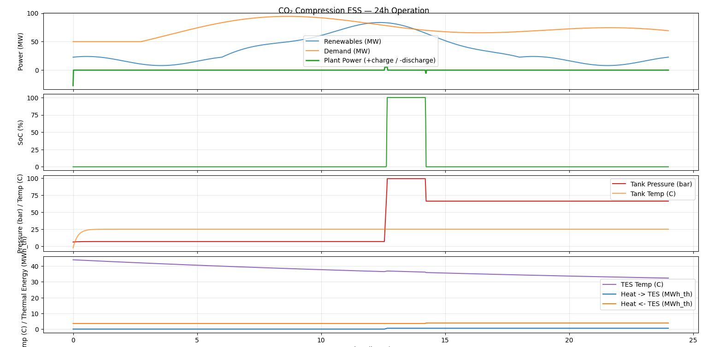

Title: CO₂/Air Compression-Based ESS — Technical Feasibility and System Behavior (Simulation)

What this document covers
- What the system is and how it works (charging/discharging)
- What the Python simulation does and what the plots show
- A quick view of technical feasibility (efficiency, pressures, temperatures)
- How to run it on your computer

1) Concept in simple words
- When there is extra renewable power, we use it to run compressors that pressurize CO₂ (or air). The hot gas gives off heat, which we store in a thermal tank (like heated rocks/concrete). The compressed gas is stored in an insulated pressure tank.
- When the grid needs power, we warm the gas using the stored heat and let it expand through a turbine to make electricity.
- Because gas and heat are stored physically, it can hold energy for long periods with very low daily loss.

2) What the simulation shows
- The model runs a 24‑hour day. It creates a simple pattern of renewable power and demand, then tells the storage when to charge or discharge.
- It tracks and plots:
  • Plant power: positive = charging, negative = generating.
  • State of charge (SoC) based on tank pressure between 70 and 90 bar.
  • Tank pressure and temperature over time.
  • Thermal Energy Storage (TES) temperature and cumulative heat in/out.

3) Key technical signals (what to look for)
- Round‑trip efficiency (RTE): How much energy we get back compared to what we put in. The simplified model typically lands around 75–80% depending on settings.
- Pressure window: 70–90 bar. This is the safe operating window used by the controller in the model.
- Heat management: The compressor’s heat mostly goes into the TES, and we use that heat during discharge to improve efficiency.
- Daily losses: Insulation values are set so that daily energy loss is low (tunable in code). The document target is <1%/day for vessels.

4) Assumptions kept simple (easy to tune)
- Components are lumped and steady between time steps: multi‑stage compressor with intercooling, one big storage tank, one TES block, one turbine with reheat.
- Real‑gas CO₂ properties are used if CoolProp is installed; otherwise, the code falls back to ideal‑gas approximations.
- Plant rating: 100 MW block. Tank volume: 2000 m³. Temperature ranges and losses are adjustable in the code.

5) Interpreting the plots
- Plot 1 (Power): You’ll see charging when renewables exceed demand, and discharging when demand exceeds renewables.
- Plot 2 (SoC): Goes up during charging and down during discharging. It never crosses the safety limits.
- Plot 3 (Tank): Pressure rises during charging and falls when discharging; temperature drifts with heat losses.
- Plot 4 (TES): Temperature increases when absorbing compressor heat and decreases when reheating gas for the turbine. The cumulative heat curves show how much heat has flowed in and out.

6) Output summary in the console
- Round‑trip efficiency (simulated)
- Estimated energy capacity (from the tank size and assumed energy density)
- A placeholder LCoS value for documentation (replace with your actual BoM‑based numbers)

7) How to run (Windows PowerShell)
- Open a terminal in the project folder and run:

  python -m pip install -r requirements.txt
  python .\main.py

- A window with plots will open. The console will print the summary lines.

8) What this tells us about feasibility
- The system’s core physics works with commercially realistic pressures and temperatures.
- With decent insulation and heat recovery, the energy returned to the grid is in the mid‑70% range in this simple model.
- The control logic can prioritize renewables and follow load changes, which is essential for grid support.

9) Where to go next
- Replace the synthetic day‑ahead profiles with real site data.
- Tune component parameters (efficiency, heat exchanger performance) and check the change in RTE.
- Swap CO₂ for air to compare behavior and sizing needs.
- Link the simple LCoS calculator to your actual bill of materials and duty profile.
